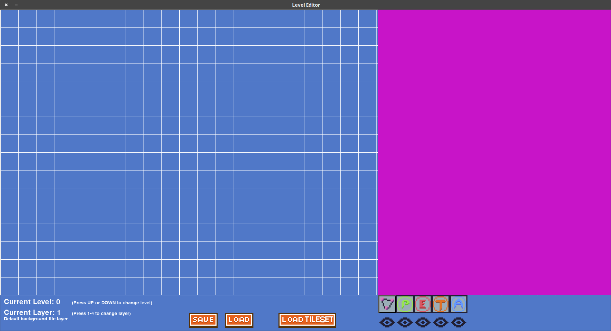
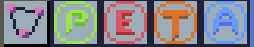
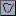

# LevelEditor
A simple level editor for creating 2D maps. 

## Editor Layout
The editor can be divided into 3 main areas as depicted in the following figure:

The grid on the left side is the area which shows the current map data and where 
individual tiles are placed.

At the bottom area there are some information regarding the current layer that is selected, 
a  and  button to save/load 
a map file, a  
to load a tile set and special buttons () 
that are used to place special elements on the map. 

The magenta colored area on the right side is reserved for the tile set.
This is the area where you select the tile you
want to place on the grid area.
A tile set can be loaded by clicking on the 
button at the bottom area. 

## Map data
A map is stored as a `*.map` file which basically is a python dictionary 
with the following entries:

- tileset_config  
  Stores information about the tile sets that are used for the map. 
  Note, that it stores the path to the tile set folder, the size of a tile (width and height), 
  the scale factor used on the tiles for rendering and other information.
  
- world_data  
  The world data stores the actual map information, i.e., the constellation of the tiles. 
  The world data is organized in four layers where each layer can be used for different kind of tiles. 
  For example, layer 1 might be used for background tiles, layer 2 for tiles that are in front of layer 1 (e.g., to set elevators or other moveable tiles), 
  layer 3 can be used for decorative elements (e.g., blood traces, boxes, dust, etc.), and layer 4 might be used for elements that are in front of the player to create more deepth in the map

- graph_data  
  The graph data stores, as the name suggests, a graph that is used for path findings (e.g., that is used by AI bots)

## Loading Tile Sets
Loading a tile set is done by clicking on the  button. 
This opens a file dialog in which you have to specify the folder where
the tile images are located. Note, that the file name of the tile images
has to be in the format 

`tile_<num>.png`

where <num> stands for the number of tile image.

## Creating Maps
To create a map you simply have to select a tile on the right side
panel and then click the left mouse button on the grid field on the left side to place the
selected tile on that cell position. 
You can also hold the left mouse button to place the same tile on several
grid cells by moving the mouse. 

Tiles can be placed in one of four layers where each layer is intended to fulfill a specific purpose:

- Layer 1 - Background layer: this is the background layer. All tiles placed in this layer are considered to be in the background. 
- Layer 2 - Movable layer: this layer is intended to place tiles that might be moved and are rendered in front of (or over) the background layer
- Layer 3 - Decorative layer: this layer is intended to place decorative elements (e.g., plants, boxes, blood traces, etc.)
- Layer 4 - Foreground layer: this is the foreground layer. All tiles placed in this layer will be rendered over the player and other units/entities. This layer can be used to give your map more depth

The layer can be switched by pressing the number keys 1-4.
 
### Special Buttons
Beneath the right tile panel you can see several buttons (see the following figure). 
These are used to place specific elements on the map. 

	
#### Player Position 
Clicking this button enables you to set the player's start position on the map. When
clicking a grid, a corresponding player symbol () 
appears at the top right corner of the 
grid cell. 

Currently, there can only be placed one player symbol in a map. When you click on another 
cell with this button enabled, the player symbol position will be updated accordingly.  

TODO: Editing player properties (e.g., health)

#### Adding Enemies 
This button allows you to place enemy units in your map. The procedure works similar to the mode of setting the player's position. 
However, it is possible to set more than one enemies in the map. Only one enemy can be placed within a cell and it is designated by 
a red circle () on the top left corner of the cell.
On the circle you will see a number telling you the number ID of the placed enemy symbol.

TODO: Editing enemy properties (e.g., type, health, AI behavior)

#### Adding Triggers  and Actions 
TODO

#### Adding Paths 
When this button is active, you can create a graph in the grid world. 
A graph consists of nodes () and edges ().
To place a node you simply have to click the left mouse button on a cell. 
There can be placed only one node in a cell and the graph may have as many nodes as you like.
Similar to enemy units, a number will be set on the instance of a node indicating its assigned ID.

To connect two nodes, i.e., putting an edge between them, you first have to click on an existing node with the left mouse button
which then will be highlighted (). 
If you now left click on another (not the same) node, a straight line will be drawn between them indicating the edge between them. 

To erase a node, you can right click on a cell with an existing node.

### Save/Load Maps
To save a map you have to click on the  button in the bottom panel
and set a file name. 

To load a map you have to click on the  button in the bottom panel
and choose the desired map data to load. 

